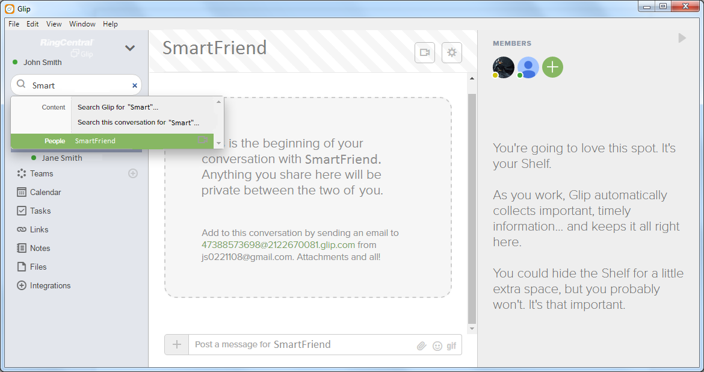
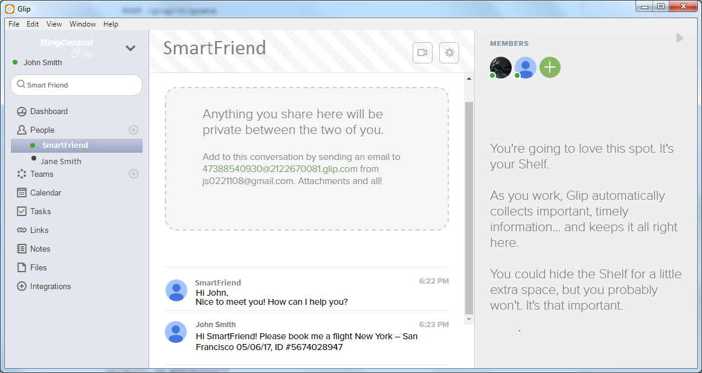

**RingCentral Glip** is a messaging application, both web and desktop, providing built-in chat, tasks, calendar, file/screen sharing, video conferencing and other useful tools.

With **Glip API** you can automate conversational communications, easily synchronize notifications into a single location (greatly reducing email), programmatically generate Glip message post content, and you can even couple the new Glip API resources to operate with AI or Machine Learning to solve advanced use cases.

Now Glip API provides you with the following functionality scope:

- send messages  - *POST/restapi/v1.0/glip/posts*
- read messages filtered by chat  - *GET/restapi/v1.0/glip/posts*
- create chats - *POST /glip/v1.0/groups*
- edit chat members  - *PUT /glip/v1.0/groups/groupId*
- get chat member information - *GET/restapi/v1.0/glip/persons/personId*
- get list of chats filtered by chat type - *GET/glip/v1.0/groups*
- get particular chat(s) - *GET/glip/v1.0/groups/groupId*

To learn more about the Glip API methods please view [API Reference](https://developers.ringcentral.com/api-docs/latest/index.html). 
On top of that Glip API features chat bots. You may need a smart companion to rent a car, broadcast weather, provide currency exchange rates, send birthday messages, or just in case.

**Use Case #1**: Create bot application

To develop a bot application for Glip sign in to your RingCentral account and go to [RC Connect Platform Developer Portal](https://developers.ringcentral.com/my-account.html#/applications). For help please use our [Getting Started tutorial](https://developers.ringcentral.com/library/getting-started.html).

Let’s consider the scenario:  
You developed a bot app *SmartFriend*. Let’s see how it can be integrated, and how Glip customers can use it.

1. You should create a new extension for your bot in your RingCentral account. An activation 
   link for setting extension credentials (login and password) will be sent via email.

   **Note:** For Sandbox please use https://service.devtest.ringcentral.com. Once your app is provisioned by RingCentral for production, please use https://service.ringcentral.com. 

2. You should authorize it to Connect Platform API using the login (extension number) and       
   password.
   **Note:** For Sandbox please use the base URI is https://platform.devtest.ringcentral.com. Once your app is provisioned by RingCentral for production, please use https://platform.ringcentral.com.

3. So your Glip bot app is now integrated with Glip client application, and users can enjoy it!
   **Note:** You can use either test glip app available at https://glip.devtest.ringcentral.com, or production version available at https://glip.com.

4. First of all your bot app *SmartFriend* needs to know when a user sends a message, so it  
   should subscribe for Glip posts event. To subscribe for new messages arrival and content, please run the following request:

        POST/restapi/v1.0/subscription HTTP/1.1
        {
          "eventFilters": [
          "/restapi/v1.0/glip/posts"
           ],
          "deliveryMode": {
          "transportType": "PubNub",
          "encryption": "true"
          }
        }

        HTTP/1.1 200 OK
        {
         "uri" : "https.../restapi/v1.0/subscription/au329ec1-0600-4560-b6dc-c764399e9a54",
          "id": "au329ec1-0600-4560-b6dc-c764399e9a54",
          "creationTime" : "2017-03-21T17:41:45.601Z",
          "status" : "Active",
          "eventFilters": ["/restapi/v1.0/glip/posts"],
          "expirationTime" : "2017-03-21T17:56:45.617Z",
          "expiresIn" : 899,
          "deliveryMode" : {
          "transportType" : "PubNub",
          "encryption" : true,
          "address" : "54770517599294_6dda849e",
          "subscriberKey": "sub-c-b8b9cd8c-e906-11e2-b383-02ee2ddab7fe",
          "encryptionAlgorithm" : "AES",
          "encryptionKey" : "0mWk/6SMiSz191u2dV5drg=="
          }
        }
    

5. *SmartFriend* may also need to know when a user adds it to a chat (or removes from it), to do 
    this it should subscribe for Glip groups. It may be useful if you want to send an automated hello message to those users who add your bot to a chat. To subscribe, please run the following request:
  
    
        POST /restapi/v1.0/subscription HTTP/1.1
        {
         "eventFilters": [
           "/restapi/v1.0/glip/groups"
           ],
         "deliveryMode": {
         "transportType": "PubNub",
         "encryption": "true"
          }
        }

        HTTP/1.1 200 OK
        {
          "uri" : "https.../restapi/v1.0/subscription/ed329ec1-0600-4560-b6dc-c764399e9a54",
          "id" : "ed329ec1-0600-4560-b6dc-c764399e9a54",
          "creationTime" : "2017-03-21T16:41:45.601Z",
          "status" : "Active",
          "eventFilters": ["/restapi/v1.0/glip/groups"],
          "expirationTime" : "2017-03-21T16:56:45.617Z",
          "expiresIn" : 899,
          "deliveryMode" : {
          "transportType" : "PubNub",
          "encryption" : true,
          "address" : "54770517599294_6dda849e",
          "subscriberKey" : "sub-c-b8b9cd8c-e906-11e2-b383-02ee2ddab7fe",
          "encryptionAlgorithm" : "AES",
          "encryptionKey" : "0mWk/6SMiSz191u2dV5drg=="
          }
        } 
    

6. Once *John Smith*, a Glip app user, adds *SmartFriend* to a private chat, see the picture 
   below.
   **Note:** Private chat is a group of 2 members only.
   

7. *SmartFriend* receives a notification on being added to a chat by *John Smith*.

    
        {
          "timestamp": "2017-03-21T17:09:00.408+0000",
          "subscriptionId": "ed329ec1-0600-4560-b6dc-c764399e9a54",
          "uuid": "b11c9430-9687-4498-b12b-3fcb470bfe04",
          "event": "/restapi/v1.0/glip/groups",
          "body": {
            "eventType": "GroupJoined",
            "type": "PrivateChat",
            "id":"1234",
            "creationTime": "2017-03-21T17:00:00Z",
            "lastModifiedTime": "2017-03-21T17:09:00Z",
            "members": [
              "123456789",
              "chatbot-01"
              ]
            }
        }

8. *SmartFriend* sends *John Smith* an automated hello message:

    
        POST /glip/v1/posts
        {
          "groupId": "1234",
          "text": "Hi John, Nice to meet you! How can I help you?"
        }
    

9. *John Smith* is texting to *SmartFriend*:
   

10. *SmartFriend* receives a notification on message receipt, the payload looks like this:
  
      
        {
          "timestamp": "2017-03-21T18:29:27.408+0000",
          "subscriptionId": "a45645-0001-cc71-9de3-674476722",
          "uuid": "b11c9430-9687-4498-b12b-3fcb470bfe04",
          "event": "/restapi/v1.0/glip/posts",
          "body": {
            "eventType": "PostAdded",
            "id": "0000001",
            "type": "TextMessage",
            "text": "Hi *SmartFriend*! Please book me a flight New York – San Francisco 05/  06/17, ID #5674028947"
            "creatorId": "123456789",
            "groupId": "1234",
            "creationTime": "2017-03-21T18:29:20Z",
            "lastModifiedTime": "2017-03-21T18:29:27Z"
           }
        }

11. Your chat bot tries to parse the message, books a flight and sends a reply by running post
    request:

    
        POST /glip/v1/posts
        {
         "groupId": "1234",
         "text": "Absolutely! Your flight is booked – DL459 06MAY JFK-SFO 0805 1145, ticket number 550166377762. Have a safe trip!"
        }
    
