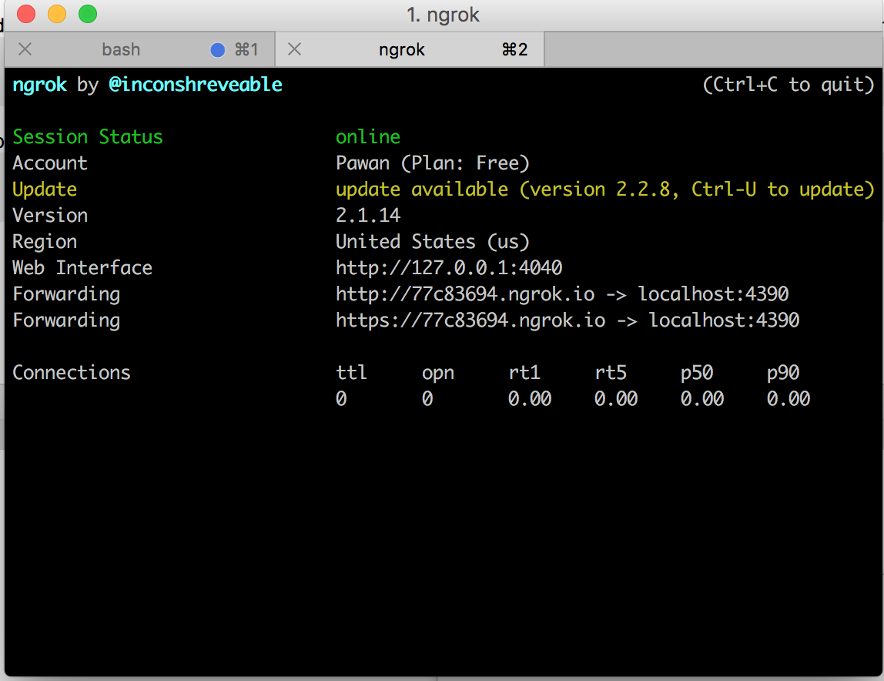
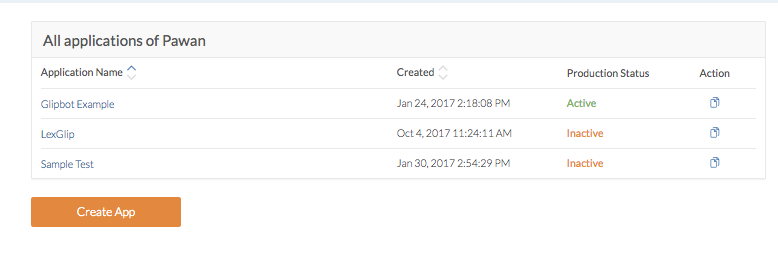
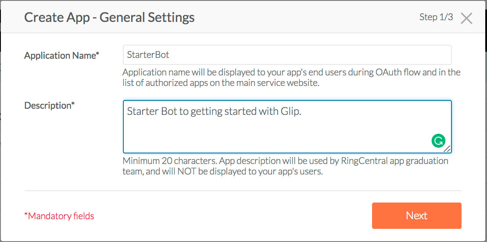
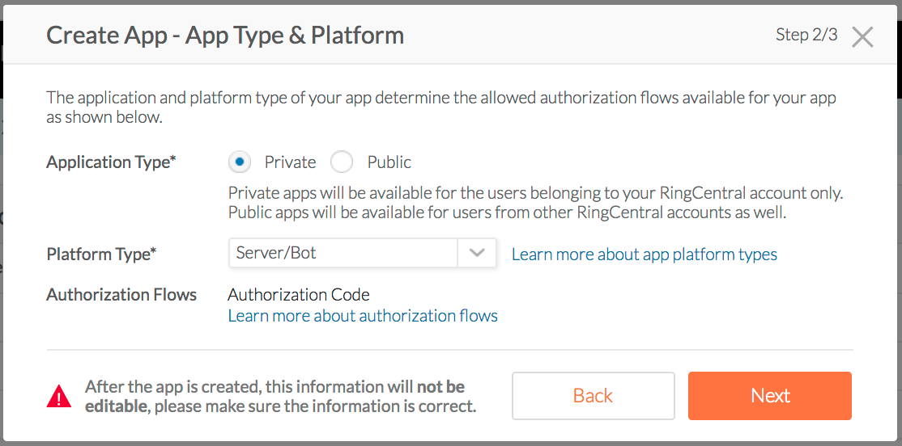
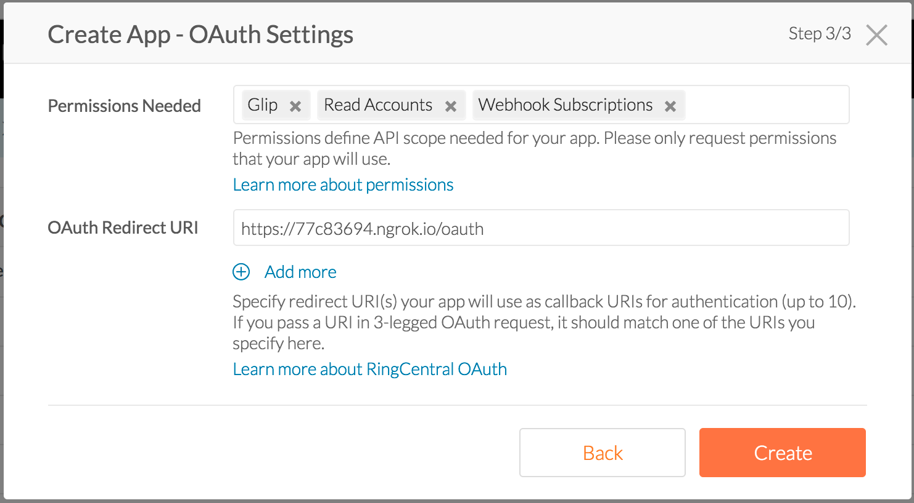
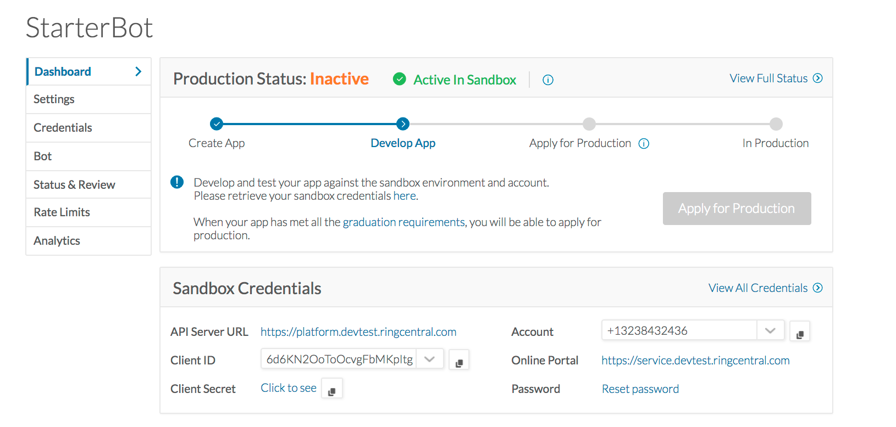
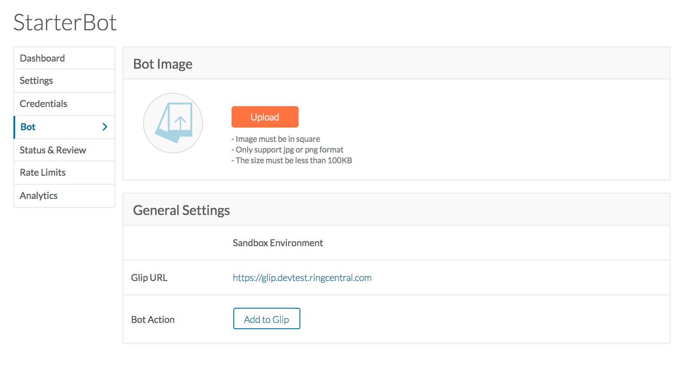
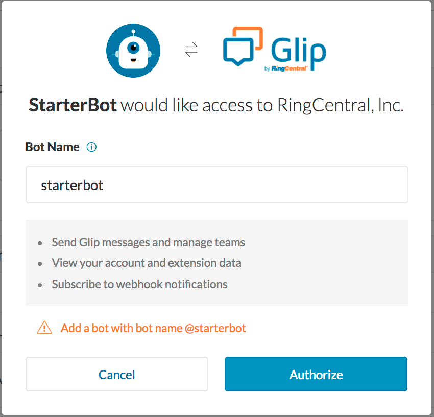
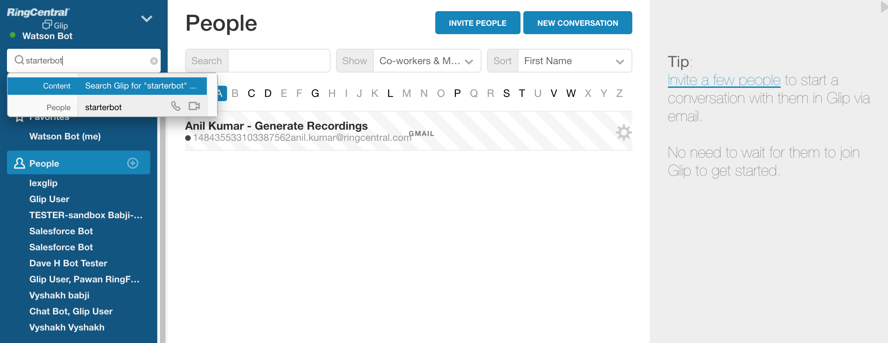

# Building bot application locally using Glip

To develop a bot application for Glip sign in to your RingCentral account and go to [RC Connect Platform Developer Portal](https://developers.ringcentral.com/my-account.html#/applications).

## Prerequisites - ngrok

Glip bot applications must have OAuth redirect URLs that are accessible over the Internet. If webhooks are used those must also be accessible over the Internet. For developing locally, a tunneling tool like ngrok is useful. To set up ngrok, use the following steps:

* Go to https://ngrok.com/ and download the version that corresponds to your platform. In our case, we'll be downloading the Mac OS X 64-bit version.
* You can extract ngrok into the folder of your preference and run ngrok from there.
* Launch ngrok by navigating to the directory where you unzipped ngrok and starting with the port you want to expose to the public internet with the following:

```
./ngrok http 4390
```

If every thing goes well you should see the follow screen.


## Create a Glip Bot application

* Sign in to [Developer Portal](https://developer.ringcentral.com) with your account login and password. If you do not have RingCentral account, please sign up.
* Open My Apps tab and click 'Create App' button.
  
* Fill in the fields of the form 'General Settings - Create App' below:
  
* Fill in the fields of the form 'General Settings - AppType & Platform'. Make sure the platform type is `Server/Bot` as below:
  
* Fill in the fields of the form 'General Settings - OAuth Settings'. Add the following permissions `Glip`, `Webhook Subscription`, `Read Accounts`. In the oAuth redirect URI field, paste your ngrok forwarding address and add the /oauth endpoint at the end of the address that we opened up in our script. Click on `Create` once done.
  
* If everything goes well you will see the following screen. We will use the `ClientID` and `ClientSecret` generated in this step to update the `.env` file during the installation phase.
  

## Create a Simple Nodejs application

Let's set up a simple web server to processes all incoming HTTP requests.

We'll be using Node.js to develop our app, so you'll need to make sure you've installed it on your machine as well.

1. Clone the sample application from [Github](https://github.com/pkvenu/developing-locally-with-Glip.git)

2. Fire up the terminal window and change the path to the cloned applicaton directory and enter the command below:

```
$ npm install
```

3. Create a copy of env.template file and rename it to `.env`

4. Update the `.env` file with the values for `CLIENT_ID`, `CLIENT_SECRET` from the the bot creation step and the `REDIRECT_HOST` from ngrok. I would look something like this:
   

5. Run the following command in terminal to launch the app.

```
$ npm start
```

6. Go to the `Bot` tab of the recently created app in the developer portal. Click on the `Add to Glip` button.

    

    This will trigger the installation of the bot and will respond back with `authorization code` to the oauth redirect Url. `NOTE:` Bot provisioner will only use the first url specificed in the oAuth settings.
    

7. You can now exchange the authorization code for an bot token using the code below:

```
    //Authorization callback method.
    app.get('/oauth', function (req, res) {
        if(!req.query.code){
            res.status(500);
            res.send({"Error": "Looks like we're not getting code."});
            console.log("Looks like we're not getting code.");
        }else {
            platform.login({
                code : req.query.code,
                redirectUri : REDIRECT_HOST + '/oauth'
            }).then(function(authResponse){
                var obj = authResponse.json();
                bot_token = obj.access_token;
                res.send(obj)
                subscribeToGlipEvents();
            }).catch(function(e){
                console.error(e)
                res.send("Error: " + e);
            })
        }
    });
```

    The access token obtained is a `permanent` access token. It's the developer responsibility to manage access token. For public applications this would mean storing the bot token in a database and mapping to a customerId. They would then use the customerId to retrieve the access token before posting back to Glip.

8. We can now subscribe to glip events using the code below:

```
               function subscribeToGlipEvents(token){
                   var requestData = {
                       "eventFilters": [
                           "/restapi/v1.0/glip/posts",
                           "/restapi/v1.0/glip/groups",
                           "/restapi/v1.0/subscription/~?threshold=60&interval=15"
                       ],
                       "deliveryMode": {
                           "transportType": "WebHook",
                           "address": REDIRECT_HOST + "/callback"
                       },
                       "expiresIn": 604799
                   };
                   platform.post('/subscription', requestData)
                       .then(function (subscriptionResponse) {
                           console.log('Subscription Response: ', subscriptionResponse.json());
                           subscription = subscriptionResponse;
                           subscriptionId = subscriptionResponse.id;
                       }).catch(function (e) {
                           console.error(e);
                           throw e;
                   });
               }

```

9. Now login to `glip.devtest.ringcentral.com` with your credentials and search for the bot name. Click on the bot name and type in "Hi" to start communicating with it.

    

10. You should now see the notification messages in the console as show below:

```
             {
               "timestamp": "2017-03-21T18:29:27.408+0000",
               "subscriptionId": "a45645-0001-cc71-9de3-674476722",
               "uuid": "b11c9430-9687-4498-b12b-3fcb470bfe04",
               "event": "/restapi/v1.0/glip/posts",
               "body": {
                 "eventType": "PostAdded",
                 "id": "0000001",
                 "type": "TextMessage",
                 "text": "Hi!"
                 "creatorId": "123456789",
                 "groupId": "1234",
                 "creationTime": "2017-03-21T18:29:20Z",
                 "lastModifiedTime": "2017-03-21T18:29:27Z"
                }
             }

```