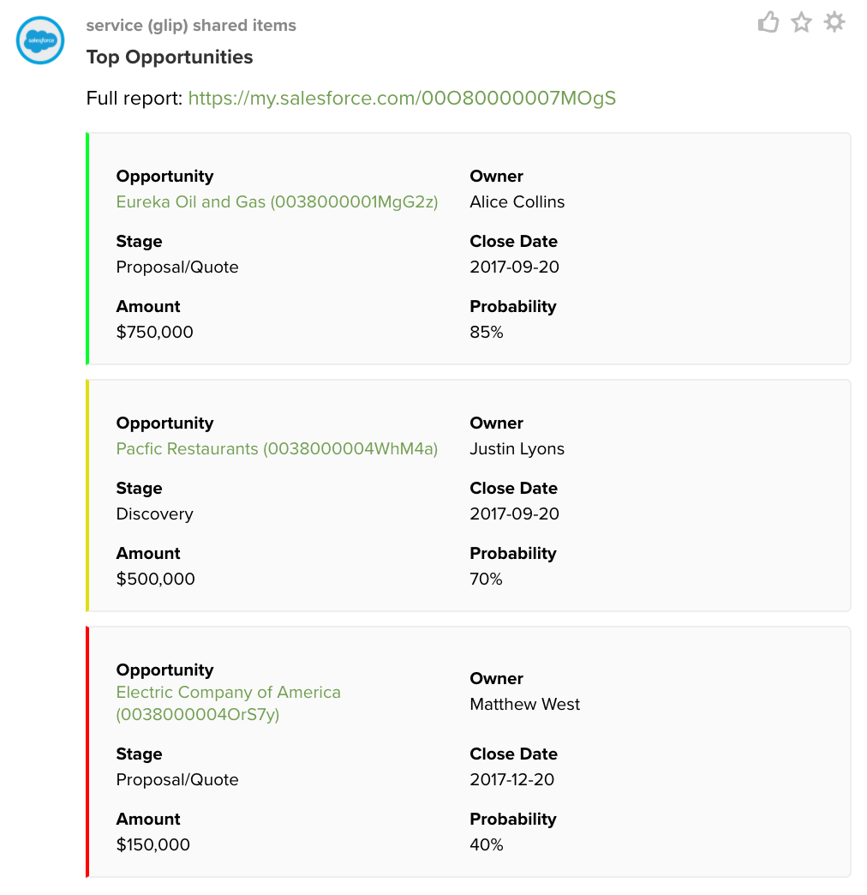
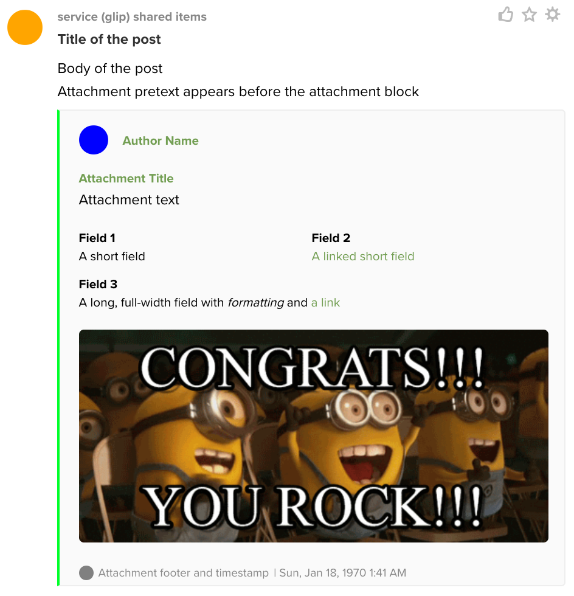

Glip Post Attachments allow you to attach rich content to posts with formatting and color indicators to more easily convey a large amount of information. This is available with both Inbound Webhooks and the REST API. Specifically you can:

* add up to 20 attachments per post, each rendered as its own section
* add an author, title, pretext, text to each attachment
* select a color for each attachment to indicate importance or subject
* render short metadata using the fields property
* render photos and images

Notes

* All fields except *text* have a char limit of 300 bytes
* The Glipdown flavor of Markdown is used
* The Inbound Webhook and REST API have slightly different schemas as shown below

Here is an example report using Salesforce:



# Post Attachment parameters

The post attachment has a number of properties that are displayed in the following locations for a webhook message below. The REST API has a similar layout. Both post schemas are described below.



## Inbound Webhook Request Example

Here is an example message body for an inbound webhook:

```
{
  "icon": "https://example.com/post_icon.png",
  "title": "**Title of the post**",
  "body": "Body of the post",
  "attachments": [
    {
      "color": "#00ff2a",
      "pretext": "Attachment pretext appears before the attachment block",
      "author_name": "Author Name",
      "author_link": "https://example.com/author_link",
      "author_icon": "https://example.com/author_icon.png",
      "title": "Attachment Title",
      "title_link": "https://example.com/title_link",
      "fields": [
        {
          "title": "Field 1",
          "value": "A short field",
          "short": true
        },
        {
          "title": "Field 2",
          "value": "[A linked short field](https://example.com)",
          "short": true
        },
        {
          "title": "Field 3",
          "value": "A long, full-width field with *formatting* and [a link](https://example.com)"
        }
      ],
      "text": "Attachment text"
      "image_url": "https://example.com/congrats.gif",
      "footer": "Attachment footer and timestamp",
      "footer_icon": "https://example.com/footer_icon.png",
      "ts": 1503723350
    }
  ]
}
```

Here is some example code:

Go: https://github.com/grokify/go-glip/tree/master/examples/test_webhook

###REST API Post Message Example

Here is the same message with slightly different property names for a API request:

```
{
  "text": "Body of the post",
  "attachments": [
    {
      "type": "Card",
      "fallback": "Attachment fallback text",
      "color": "#00ff2a",
      "intro": "Attachment intro appears before the attachment block",
        "author": {
          "name": "Author Name",
          "uri": "https://example.com/author_link",
          "iconUri": "https://example.com/author_icon.png"
        },
      "title": "Attachment Title",
      "text": "Attachment text",
      "imageUri": "https://example.com/congrats.gif",
      "thumbnailUri": "https://example.com/thumbnail_icon.png",
      "fields": [
        {
          "title": "Field 1",
          "value": "A short field",
          "style": "Short"
        },
        {
          "title": "Field 2",
          "value": "[A linked short field](https://example.com)",
          "style": "Short"
        },
        {
          "title": "Field 3",
          "value": "A long, full-width field with *formatting* and [a link](https://example.com)",
          "style": "Long"
        }
      ],
      "footnote": {
        "text": "Attachment footer and timestamp",
        "iconUri": "https://example.com/footer_icon.png",
        "time": "2018-01-05T18:52:35.993311508-08:00"
      }
    }
  ]
}
```

Here is some example code:

Go: https://github.com/grokify/go-ringcentral/tree/master/examples/glip_post_attachment

## Property Descriptions

Use these parameters to customize the appearance of a message.

**fallback** — A string of default text that will be rendered in the case that the client does not support Interactive Messages (Currently there are no Glip Clients that do not support this.)

**color** — A Hex color code that determines the color of the side border of the Interactive Message.

**pretext** — A string that will display directly above the Message.

**author** — A set of properties that will render an author section at the top of the message

* **author_name** — The actual author name string
* **author_link** — Used to link the authors name. Will only work when author_name is present.
* **author_icon** — A url to an image up to 82x82px that will display to the left of the author’s name. Will only work when author_name is present.

```
"author_name": "Author Name",
"author_link": "https://example.com/author_link",
"author_icon": "https://example.com/author_icon.png",
```

**title** — A set of properties that will render a title under the author if author is set.

* **title** — The actual title string
* **title_link** — Used to linkify the title

```
"title": "Attachment Title",
"title_link": “https://fexample.com/title_link",
```

**text** — A large string field (up to 1000 chars) to be displayed as the body of a message (markdown)

**fields** — An array of objects that will render indvidual subsections within a message

* **title** — A string that will display as the title for an individual field.
* **value** — A string that will display under the field title (Markdown)
* **style** — An enumerated string for `Short` and `Long` to indicate the width of the message, Defaults to `Long`

```
"fields”: [
  {
    "title": "Field 1",
    "value": "A short field",
    "short": true
  },
  {
    "title": "Field 2",
    "value": "[A linked short field](https://example.com)",
    "short": true
  },
  {
    "title": "Field 3",
    "value": "A long, full-width field with *formatting* and [a link](https://example.com)"
  }
],
```

**image_url** — A string url used to display a single image at the bottom of a message. We currently support GIF, JPEG and PNG. Glip only support “HTTPS” Url’s. If the URL is a http url we show a placeholder.

**thumb_url** — A string url used to display a thumbnail to the right of a message (82x82)

**footer** — A set of properties that will render a footer under the message.

* **footer** — A string used to be displayed as the body of the footer.
* **footer_icon** — A URL used to display a 32x32px icon to the left of the footer
* **ts** — A Unix timestamp to be formatted and displayed to the right of the footer

```
"footer": "Attachment footer and timestamp",
"footer_icon": "https://example.com/footer_icon.png",
"ts": 1503714729
```

### Markdown Support

Glip supports a simple form of Markdown for formatting the body of incoming messages. The following are supported for post attachments in addition to post bodies.

\*italics\*

\*\*bold\*\*

\[a link\]\(http://example.com\)

\> quote

\_underline\_

\* bullet