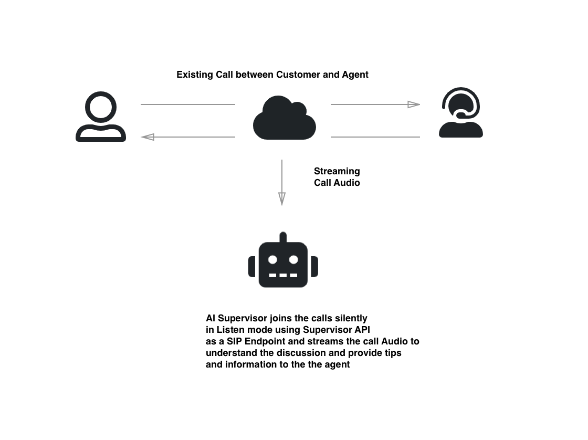

# Supervision API

## Overview

Before we start going into the details of Supervision API, let us explain a common use case where this API will be used.

The supervision API can be used to receive a real-time audio stream of a call so that a human supervisor or application and receive a real-time audio stream. In the case of an application, the real-time stream can be can be sent to a AI system that does real-time transcription and agent assist to provide guidance for agents during a call. Now you can improve your customer experience by equipping your agents to be better prepared with the information and have everything at their fingertips to delight the customer. 
 
With this in mind and the real-time audio stream can be combined with technologies like Artificial Intelligence to build an AI Supervisor. This supervisor can silently join an ongoing call between the customer and agent from a SIP server, stream the call audio, transcribe it through natural language processing (NLP) and provide real-time assistance to the agent. This helps enhance the agent's capability and also delights the customer at the same time. To add to that you also save cost by providing supervision recommendations to more agents.

Our customers implement this use case to provide real-time agent assist during ongoing call between an agent and customer. The API provides high quality, clean audio from the call which is then used by their propietry AI software to interpret the audio and provide suggestions.
 
The scenario can be visualized below:
 

  
## Prerequisites

Before we dive deep into the API details lets first understand what the prerequisites for using this API:

1. Your RingCentral Account should have Call Monitoring Group feature enabled as designed in this [Knowledgebase article](
https://support.ringcentral.com/s/article/8050?language=en_US).

2. Set up a Call Monitoring Group with Agents and Supervisors in the [Online Account Portal](https://service.ringcentral.com). You can also create,update and view details on call monitoring group using RingCentral public [APIs](https://developers.ringcentral.com/api-reference#Account-Provisioning-createCallMonitoringGroup)

3. The supervisor should be configured with a SIP device such as SIP server, that should be configured to accept "auto-answer" sip:INVITE. By default it should always be true and should work.

>**Note**: This feature is only available in a production enviornment and not supported in a sandbox enviornment.

## Supervision API Anatomy

**API Endpoint** `/v1.0/account/{accountId}/telephony/sessions/{sessionId}/supervise`

Method: POST

**Request Body:**

```
{  
   "mode": "Listen",
   "extensionNumber": "103",
   "deviceId": "
}
```

Lets now define what all details you need to make a sucessful call. 

1. **telephonySessionId:** (in the API request path parameter as {sessionId} ):
You can get telephonySessionId from the Account level Presence API endpoint : 
`/restapi/v1.0/account/:accountId/presence/detailedTelephonyState=true&sipData=true`

You will see , something like below. Here the Agent Extension 108 is in an active call with the customer mentioned in "from" element.You will also get the telephonySessionId needed to call the Supervision API. 

 ```
    {
      "uri": "https://platform.ringcentral.com/restapi/v1.0/account/809646016/extension/62226587016/pr esence",
            "extension": {
                "uri": "https://platform.ringcentral.com/restapi/v1.0/account/809646016/extension/62226587016",
                "id": 62226587016,
                "extensionNumber": "108"
            },
            "presenceStatus": "Busy",
            "telephonyStatus": "CallConnected",
            "userStatus": "Available",
            "dndStatus": "TakeAllCalls",
            "meetingStatus": "Disconnected",
            "allowSeeMyPresence": true,
            "ringOnMonitoredCall": false,
            "pickUpCallsOnHold": false,
            "activeCalls": [
                {
                    "id": "8bd930cab325416aa054238237eb8832",
                    "direction": "Inbound",
                    "fromName": "ROY,DIBYENDU",
                    "from": "+14083388064",
                    "toName": "Dibyendu Roy",
                    "to": "+12053788673",
                    "telephonyStatus": "CallConnected",
                    "sipData": {
                        "toTag": "qf-7.p-XGI9-o3D7bA3j7ihdOqfT0Z9D",
                        "fromTag": "10.13.22.25-5070-742e2a888ab14be",
                        "remoteUri": "do-not-use-me-I-am-useless",
                        "localUri": "do-not-use-me-I-am-useless"
                    },
                    "sessionId": "183851523016",
                    "startTime": "2019-03-26T22:16:29.629+0000",
                    "partyId": "cs168629785304410134536-2",
                    "telephonySessionId": "XXXXXXXXXX"
                }
            ]
        }
  ```


2. **Extension Number:** You would need the extension number of the agent whose call you want to   monitor. In the example case shown here, it s 108 (Agent Extension).

Note: In future we shall also support extensionId.

3. **deviceId:** This is the `deviceId` of the Supervisor's SIP device. You can get the supervisor's deviveID using the Extension device info API `/restapi/v1.0/account/~/extension/~/device`

It will have a response as below

``` 
{
            "uri": "https://platform.ringcentral.com/restapi/v1.0/account/809646016/device/60727004",
            "id": "60727004",
            "type": "SoftPhone",
            "sku": "DV-1",
            "name": "Softphone - Digital Line",
            "serial": "LMRC8531",
            "computerName": "LMRC8531",
            "status": "Online",
            "extension": {
                "uri": "https://platform.ringcentral.com/restapi/v1.0/account/809646016/extension/809646016",
                "id": 809646016,
                "extensionNumber": "101"
            }
 ```
 
Now that you have the telephonySessionID, Agent extension number and Supervisor deviceID, you are all set to make call the Supervise API. "id": "60727004" is the deviceId you need. Now you are all set to call the API.

**Supervision API Call**

`POST /restapi/v1.0/account/~/telephony/sessions/XXXXXXXXXX/supervise`

Body:

```
{  
   "mode": "Listen",
   "extensionNumber": "108",
   "deviceId":"60727004"
}
```

Make sure you are using the correct accountId where this call is happening. The "mode" value is "Listen", and it instructs the backend to make sure the supervisor is joining the call in silent mode without any **"BEEP"** noise.

**Sample Response**

```
{
    "direction": "Outbound",
    "from": {
        "deviceId": "60727004",
        "extensionId": "809646016",
        "name": "Supervisor ABC",
        "phoneNumber": "101"
    },
    "id": "party-4",
    "muted": false,
    "owner": {
        "accountId": "809646016",
        "extensionId": "809646016"
    },
    "standAlone": false,
    "status": {
        "code": "Answered",
        "reason": "Supervising"
    },
    "to": {
        "extensionId": "62226587016",
        "name": "Dibyendu Roy",
        "phoneNumber": "108"
    }
}
```

You can see that the reponse shows the supervisor joining the Agent extension with a seperate partyId example : party4 here.

What will happen is, it will make the Supervisor device join the existing Customer-Agent session silently and now the Supervisor can listen or stream the audio. 

To verify that the supervisor has joined the call you can use the, account level presence API and see that additonal party has been added to the existing agent session:

`GET /restapi/v1.0/account/:accountId/presence?detailedTelephonyState=true&sipData=true`

The party will appear in the `activeCalls` list such as the following example:

```
"activeCalls": [
                {
                    "id": "aa97ce30b90441158a421ca0e9c0a233",
                    "direction": "Outbound",
                    "fromName": "Supervisor ABC",
                    "from": "101",
                    "toName": "Agent",
                    "to": "108",
                    "telephonyStatus": "CallConnected",
                    "sipData": {
                        "toTag": "I2rPJdYwDjuEeOFJpT2pDszuCrepqQsL",
                        "fromTag": "10.14.23.50-5070-a272ac7ba84b4a7",
                        "remoteUri": "do-not-use-me-I-am-useless",
                        "localUri": "do-not-use-me-I-am-useless"
                    },
                    "sessionId": "590506730017",
                    "startTime": "2019-03-27T19:14:22.564+0000",
                    "partyId": "party-4",
                    "telephonySessionId": "XXXXXXXXXX"
                }
            ]
 ```

> **Note:** If you would be saving the audio stream, please make sure you comply with the FCC guidelines and letting the customer know that the calls will be monitored. 

Here you can also find a [Video](https://vimeo.com/326948521) that demonstrates a working example of a Supervision API using the concepts described here.
