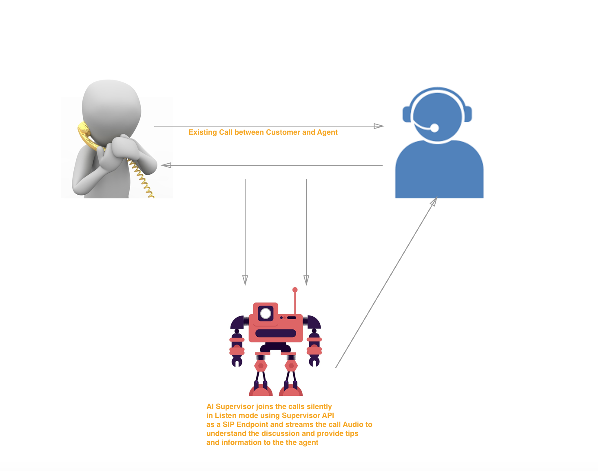

# Supervision API

## Overview

 Before we start going into the details of Supervision API, let us explain a use case and a business scenario where this API will be used by one of our customer.
 
 **Usecase** : Imagine a contact center scenario. This is an inbound contact center where your customers are calling in and the calls are being handled by your designated agents. Now you decided that inorder to improve your customer experience , you want your agents to be better equipped with all the information and have everything at their fingertips to delight the customer. With this in mind and combined with technologies like Artificial Intelligence, you decided to build an AI Supervisor. This supervisor can silently join an ongoing call between the customer and agent from a SIP device , stream the call audio , underatsnd it through NLP and provide run-time assistance information to the agent.An this helps enhancing the agent's capability and also delighting the customer at the same time. To add to that you also save cost by saving money that would otherwise have to be spent on hiring multiple supervisiors for your contact center.
 
 This was a real usecase for one of our customers and we provided them the supervision API to solve the piece of the puzzle where they can silently join an oginoing call between an agent and customer , stream clean and high quality audio from the call and then use their propietry AI software to interpret the audio and provide suggestions.
 
 The scenario can be visualized below

  
## Prerequisites

Before we dive deep into the API details lets first understand what the pre-requisites are before using this API

1. You should have a Call Monitoring Group defined as described [here](https://support.ringcentral.com/s/article/8050?language=en_US) . And the RC Account should have Call Monitoring Group feature enabled.

2. You need to make sure that your Supervisor Extension is allowed to monitor the Agent Extensions

3. Make sure the Agent and Supervisor are in your Call Monitoring Group.

You can also create,update and view details on call monitoring group using RingCentral public [APIs](https://developers.ringcentral.com/api-reference#Account-Provisioning-createCallMonitoringGroup)

4. The Supervisor SIP device should accept "auto-answer" sip:INVITE (By default it should always be true and should work)

## Supervision API Anatomy

**API Endpoint** `/v1.0/account/{accountId}/telephony/sessions/{sessionId}/supervise`

Method : POST

**Request Body** :
telephonySessionId for the existing session between the customer and the Agent. 
`{  
   "mode": "Listen",
   "extensionNumber": "103",
   "deviceId": "
}`

Lets now define what all details you need to make a sucessful call. 

1. telephonySessionId (in the API request path parameter):
You can get telephonySessionId from the Account level Presence API endpoint : 
`/restapi/v1.0/account/:accountId/presence/detailedTelephonyState=true&sipData=true`

You will see , something like below. Here the Agent Extension 108 is in an active call with the customer mentioned in "from" element.You will also get the telephonySessionId needed to call the Supervision API. 

 `{
     "uri": "https://platform.ringcentral.com/restapi/v1.0/account/809646016/extension/62226587016/presence",
            "extension": {
                "uri": "https://platform.ringcentral.com/restapi/v1.0/account/809646016/extension/62226587016",
                "id": 62226587016,
                "extensionNumber": "108"
            },
            "presenceStatus": "Busy",
            "telephonyStatus": "CallConnected",
            "userStatus": "Available",
            "dndStatus": "TakeAllCalls",
            "meetingStatus": "Disconnected",
            "allowSeeMyPresence": true,
            "ringOnMonitoredCall": false,
            "pickUpCallsOnHold": false,
            "activeCalls": [
                {
                    "id": "8bd930cab325416aa054238237eb8832",
                    "direction": "Inbound",
                    "fromName": "ROY,DIBYENDU",
                    "from": "+14083388064",
                    "toName": "Dibyendu Roy",
                    "to": "+12053788673",
                    "telephonyStatus": "CallConnected",
                    "sipData": {
                        "toTag": "qf-7.p-XGI9-o3D7bA3j7ihdOqfT0Z9D",
                        "fromTag": "10.13.22.25-5070-742e2a888ab14be",
                        "remoteUri": "do-not-use-me-I-am-useless",
                        "localUri": "do-not-use-me-I-am-useless"
                    },
                    "sessionId": "183851523016",
                    "startTime": "2019-03-26T22:16:29.629+0000",
                    "partyId": "cs168629785304410134536-2",
                    "telephonySessionId": "XXXXXXXXXX"
                }
            ]
        }`

2. **Extension Number** : You would need the extension number of the agent whose call you want to   monitor. In the example case shown here, it s 108 (Agent Extension).

Note : In future we shall also support extensionId.

3. **deviceId** : This is the deviceId of the Supervisor's SIP device. You can get the supervisor's deviveID using the Extension device info API " `https://{{RC_SERVER_HOSTNAME}}/restapi/v1.0/account/~/extension/~/device`

It will have a response as below

` {
            "uri": "https://platform.ringcentral.com/restapi/v1.0/account/809646016/device/60727004",
            "id": "60727004",
            "type": "SoftPhone",
            "sku": "DV-1",
            "name": "Softphone - Digital Line",
            "serial": "LMRC8531",
            "computerName": "LMRC8531",
            "status": "Online",
            "extension": {
                "uri": "https://platform.ringcentral.com/restapi/v1.0/account/809646016/extension/809646016",
                "id": 809646016,
                "extensionNumber": "101"
            }`

Now that you have the telephonySessionID, Agent extension number and Supervisor deviceID, you are all set to make call the Supervise API.

**Supervision API Call**

`POST https://{{RC_SERVER_HOSTNAME}}/restapi/v1.0/account/~/telephony/sessions/xysysysysysys/supervise

Body :

{  
   "mode": "Listen",
   "extensionNumber": "108",
   "deviceId":"60727004"
}`

Make sure you are using the correct accountId where this call is happening. The "mode" value is "Listen", and it instructs the backend to make sure the supervisor is joining the call in silent mode without any noise.

**Sample Response**

`
{
    "direction": "Outbound",
    "from": {
        "deviceId": "60727004",
        "extensionId": "809646016",
        "name": "Supervisor ABC",
        "phoneNumber": "101"
    },
    "id": "party-4",
    "muted": false,
    "owner": {
        "accountId": "809646016",
        "extensionId": "809646016"
    },
    "standAlone": false,
    "status": {
        "code": "Answered",
        "reason": "Supervising"
    },
    "to": {
        "extensionId": "62226587016",
        "name": "Dibyendu Roy",
        "phoneNumber": "108"
    }
}
`

You can see that the reponse shows the supervisor joining the Agent extension with a seperate partyId example : party4 here.

What will happen is, it will make the Supervisor device join the existing Customer-Agent session silently and now the Supervisor can listen or stream the audio. 

To verify that the supervisor has joined the call you can use the , Account level presence API `https://{{RC_SERVER_HOSTNAME}}/restapi/v1.0/account/:accountId/presence?detailedTelephonyState=true&sipData=true` and see that additonal party has been added to the existing agent Session.

`
"activeCalls": [
                {
                    "id": "aa97ce30b90441158a421ca0e9c0a233",
                    "direction": "Outbound",
                    "fromName": "Supervisor ABC",
                    "from": "101",
                    "toName": "Agent",
                    "to": "108",
                    "telephonyStatus": "CallConnected",
                    "sipData": {
                        "toTag": "I2rPJdYwDjuEeOFJpT2pDszuCrepqQsL",
                        "fromTag": "10.14.23.50-5070-a272ac7ba84b4a7",
                        "remoteUri": "do-not-use-me-I-am-useless",
                        "localUri": "do-not-use-me-I-am-useless"
                    },
                    "sessionId": "590506730017",
                    "startTime": "2019-03-27T19:14:22.564+0000",
                    "partyId": "party-4",
                    "telephonySessionId": "XXXXXXXXXX"
                }
            ]
`

