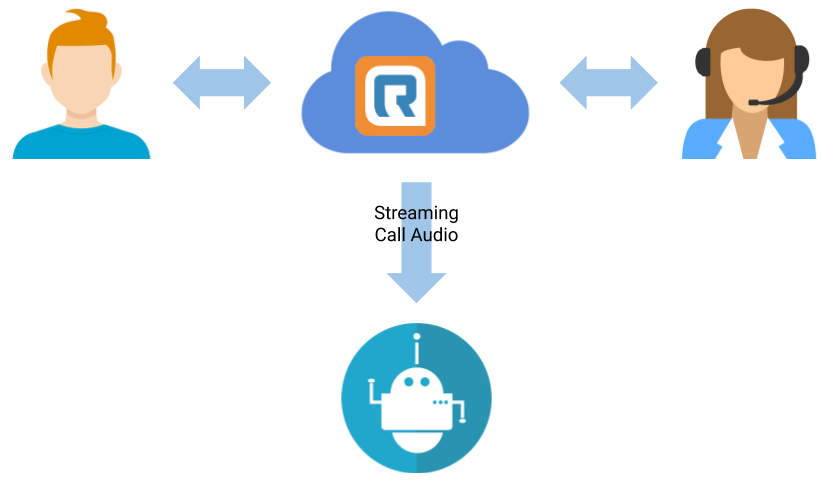

# Supervision API

## Overview

Before we start going into the details of Supervision API, let us explain a common use case where this API will be used.

The [RingCentral Call Monitoring](https://www.ringcentral.com/office/features/call-monitoring/overview.html) feature allows a person, typically a supervisor, or an app to receive a real-time audio stream so they can listen in on a call in real-time and provide feedback to an existing call, typically one with an agent. The Supervision API allows a human or app "supervisor" to be added programatically.

One use case for the Supervision API is to add a app to a a call that provids real-time transcription and agent assist to provide guidance for agents during a call. This can improve your customer experience by equipping your agents are better prepared with the information and have everything at their fingertips to delight the customer. 

To build an effective, programmatic supervisor or coach, the real-time audio stream can be combined with technologies like artificial intelligence to build an automated supervisor. This supervisor can silently join multiple, ongoing calls between  customers and agents from a single SIP server application, stream the call audio, transcribe it through natural language processing (NLP) and provide real-time assistance to the agent. This helps enhance the agent's capability and also delights the customer at the same time. You also improve performance by providing supervision recommendations to more agents.

Our customers implement this agent assist use case to provide real-time suggestions during ongoing calls between agents and customers. The API provides high quality, clean audio from the call which is then used by their proprietry AI software to interpret the audio and provide suggestions.
 
The scenario can be visualized below. Once the call is established, the Supervision API can be used to join the app by providing the call's `sessionId` and the agent's `extensionNumber` and the supervisor's `deviceId`.
 

  
## Prerequisites

Before we dive deep into the API details let's first understand the prerequisites for using this API:

1. Your RingCentral Account should have Call Monitoring Group feature enabled as described in this [Knowledgebase article](
https://support.ringcentral.com/s/article/8050?language=en_US).

2. Set up a Call Monitoring Group with Agents and Supervisors in the [Online Account Portal](https://service.ringcentral.com). You can also create, update and view details on call monitoring group using [RingCentral public APIs](https://developers.ringcentral.com/api-reference#Account-Provisioning-createCallMonitoringGroup).

3. The supervisor should be configured with a SIP device such as VoIP phone or a SIP server, that should be configured to accept "auto-answer" sip:INVITE. For the Supervision API to work, this should always be true.

> **Note**: This feature is only available in a production enviornment and not supported in a sandbox enviornment.

## Supervise Call API

The Supervise Call API is used to have RingCentral initiate a call out to a registered device such as a VoIP phone or SIP server as follows.

### Request

```http tab="Request"
POST /restapi/v1.0/account/{accountId}/telephony/sessions/{telephonySessionId}/supervise HTTP/1.1
Content-Type: application/json
Content-Length: ACTUAL_CONTENT_LENGTH_HERE
Authorization: <YOUR_ACCESS_TOKEN>

{  
   "mode": "Listen",
   "extensionNumber": "108",
   "deviceId": "60727004"
}
```

Lets now define what all details you need to make a sucessful call. 

1. **telephonySessionId:** (in the API request path parameter as {sessionId} ):
You can get telephonySessionId from the Account level Presence API endpoint : 
`/restapi/v1.0/account/:accountId/presence/detailedTelephonyState=true&sipData=true`

You will see , something like below. Here the Agent Extension 108 is in an active call with the customer mentioned in "from" element.You will also get the telephonySessionId needed to call the Supervision API. 

```
{
   "uri":"https://platform.ringcentral.com/restapi/v1.0/account/809646016/extension/62226587016/pr esence",
   "extension":{
      "uri":"https://platform.ringcentral.com/restapi/v1.0/account/809646016/extension/62226587016",
      "id":62226587016,
      "extensionNumber":"108"
   },
   "presenceStatus":"Busy",
   "telephonyStatus":"CallConnected",
   "userStatus":"Available",
   "dndStatus":"TakeAllCalls",
   "meetingStatus":"Disconnected",
   "allowSeeMyPresence":true,
   "ringOnMonitoredCall":false,
   "pickUpCallsOnHold":false,
   "activeCalls":[
      {
         "id":"8bd930cab325416aa054238237eb8832",
         "direction":"Inbound",
         "fromName":"ROY,DIBYENDU",
         "from":"+14083388064",
         "toName":"Dibyendu Roy",
         "to":"+12053788673",
         "telephonyStatus":"CallConnected",
         "sipData":{
            "toTag":"qf-7.p-XGI9-o3D7bA3j7ihdOqfT0Z9D",
            "fromTag":"10.13.22.25-5070-742e2a888ab14be",
            "remoteUri":"do-not-use-me-I-am-useless",
            "localUri":"do-not-use-me-I-am-useless"
         },
         "sessionId":"183851523016",
         "startTime":"2019-03-26T22:16:29.629+0000",
         "partyId":"cs168629785304410134536-2",
         "telephonySessionId":"XXXXXXXXXX"
      }
   ]
}
```


2. **Extension Number:** You would need the extension number of the agent whose call you want to   monitor. In the example case shown here, it s 108 (Agent Extension).

Note: In future we shall also support extensionId.

3. **deviceId:** This is the `deviceId` of the Supervisor's SIP device. You can get the supervisor's deviveID using the Extension device info API `/restapi/v1.0/account/~/extension/~/device`

It will have a response as below

``` 
{
   "uri":"https://platform.ringcentral.com/restapi/v1.0/account/809646016/device/60727004",
   "id":"60727004",
   "type":"SoftPhone",
   "sku":"DV-1",
   "name":"Softphone - Digital Line",
   "serial":"LMRC8531",
   "computerName":"LMRC8531",
   "status":"Online",
   "extension":{
      "uri":"https://platform.ringcentral.com/restapi/v1.0/account/809646016/extension/809646016",
      "id":809646016,
      "extensionNumber":"101"
   }
}
 ```
 
Now that you have the telephonySessionID, Agent extension number and Supervisor deviceID, you are all set to make call the Supervise API. "id": "60727004" is the deviceId you need. Now you are all set to call the API.

**`mode`** value is "Listen", and it instructs the backend to make sure the supervisor is joining the call in silent mode.

> Note: this API will not result in a beep sound that is present when manually monitoring a call via `*80` so that transcription apps can get a clearer stream.


### Response

```http tab="Response"
{
    "direction": "Outbound",
    "from": {
        "deviceId": "60727004",
        "extensionId": "809646016",
        "name": "Supervisor ABC",
        "phoneNumber": "101"
    },
    "id": "party-4",
    "muted": false,
    "owner": {
        "accountId": "809646016",
        "extensionId": "809646016"
    },
    "standAlone": false,
    "status": {
        "code": "Answered",
        "reason": "Supervising"
    },
    "to": {
        "extensionId": "62226587016",
        "name": "Dibyendu Roy",
        "phoneNumber": "108"
    }
}
```

You can see that the reponse shows the supervisor joining the Agent extension with a seperate `partyId` example : party4 here.

What will happen is, it will make the Supervisor device join the existing Customer-Agent session silently and now the Supervisor can listen or stream the audio. 

To verify that the supervisor has joined the call you can use the, account level presence API and see that additional party has been added to the existing agent session:

`GET /restapi/v1.0/account/:accountId/presence?detailedTelephonyState=true&sipData=true`

The party will appear in the `activeCalls` list such as the following example:

```
{
   "activeCalls":[
      {
         "id":"aa97ce30b90441158a421ca0e9c0a233",
         "direction":"Outbound",
         "fromName":"Supervisor ABC",
         "from":"101",
         "toName":"Agent",
         "to":"108",
         "telephonyStatus":"CallConnected",
         "sipData":{
            "toTag":"I2rPJdYwDjuEeOFJpT2pDszuCrepqQsL",
            "fromTag":"10.14.23.50-5070-a272ac7ba84b4a7",
            "remoteUri":"do-not-use-me-I-am-useless",
            "localUri":"do-not-use-me-I-am-useless"
         },
         "sessionId":"590506730017",
         "startTime":"2019-03-27T19:14:22.564+0000",
         "partyId":"party-4",
         "telephonySessionId":"XXXXXXXXXX"
      }
   ]
   ...
}
```

> **Note:** If you would be saving the audio stream, please make sure you comply with the FCC guidelines and letting the customer know that the calls will be monitored. 

Here you can also find a [Video](https://vimeo.com/326948521) that demonstrates a working example of a Supervision API using the concepts described here.
